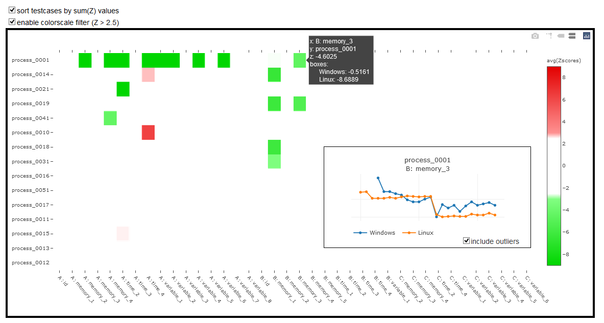

# MultiVariate Data Analysis

## Anomaly Detection

Discovering anomalies in complex multivariate and multidimensional data can be quite a challenge. Visualizing these anomalies can be even trickier, especially if you want to keep it simple without having to go over thousands of charts to filter out issues from false positives and noise. Using statistical methods we can aggregate complex data to be displayed on a single heatmap. By hovering over specific cells, we can quickly display the individual data on charts.

Heatmap: https://inevolin.github.io/Industrial-Data-Analysis/hmap1.html?testdays=3&testlike=1

This system was first implemented for a high-tech enterprise's CI/CD pipeline. It is being used by R&D, Q&A and management to keep track of all processes and variables throughout the development lifecycle. Any anomalies can easily be identified and pinpointed as soon as they appear on the heatmap. Anomalous decreases (green) indicate performance improvements (time, memory and parameter reductions), while degradations (red) imply performance issues.

Very subtle improvements or degradations are tricky to identify and detect, but overall the system has a very high accuracy. The best use of this system is for data that should remain static over time, it may not work very well if you have alternating/seasoned/wave-like data. Separate charts can be built for mapping GitHub commits to each individual data point, allowing the team to instantly pinpoint which code change caused which performance change.

The demo URL can contains three parameters:
- `testdays`: how many days from the data should be used as test data (versus baseline data)
- `testlike`: filter data whose `test` value should contain a certain string (these are the Y-axis values)
- `annotate`: (0 or 1) primarily for debugging reasons, indicating whether to show Z-values on each cell (may slow down your browser!)

This code may not be directly usable for your purposes, but the general idea of using statistical functions like MADe and Z-values to detect anomalies in datasets may be very useful in CI/CD pipelines but also many industrial processes.

## Contact

For enquiries or issues get in touch with me:

Name: [Ilya Nevolin](https://www.linkedin.com/in/iljanevolin/)

Email: ilja.nevolin@gmail.com
